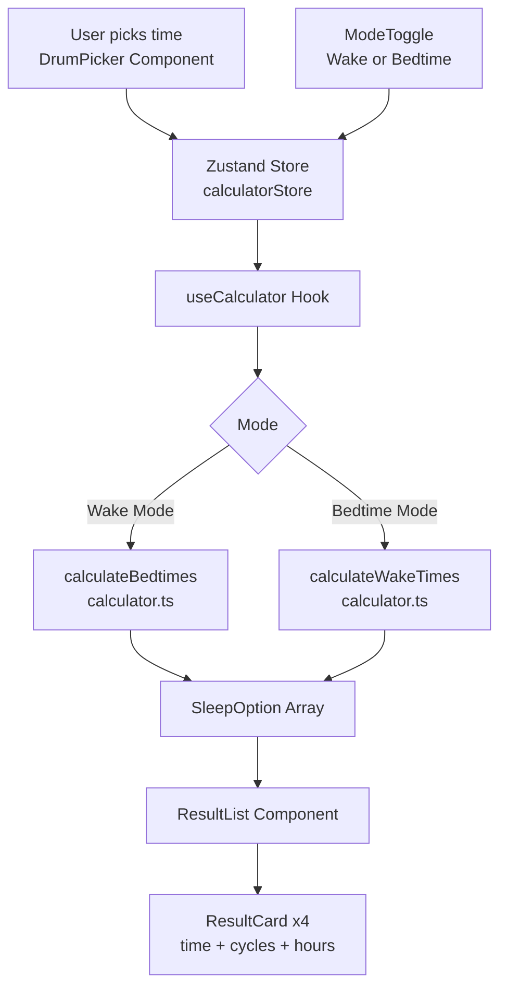

# CycleWake Project Overview

## Elevator Pitch
CycleWake is a minimal, glassmorphic sleep-cycle alarm calculator web application that helps users avoid mid-cycle wake-ups by calculating optimal bedtimes and wake times based on 90-minute sleep cycles.

## Problem
Waking up in the middle of a deep sleep cycle causes sleep inertia (grogginess), leaving people feeling exhausted even after sleeping for many hours. Most alarm clocks do not account for natural human sleep cycles.

## Target User
Anyone who wants to wake up feeling refreshed. The application is designed to be completely frictionless, requiring minimal cognitive load so even non-technical users, sleepy individuals, or children can use it instantly.

## Tech Stack (Revised)
- **Framework:** Next.js 15 (App Router) - Provides built-in routing, API routes, and SSR/SSG. Allows the app to scale gracefully from an MVP calculator to a full-stack dashboard with OAuth and database tracking.
- **Language:** TypeScript - Ensures type-safe calculation logic and API contracts.
- **Styling:** Tailwind CSS + CSS Variables - Utility-first styling combined with centralized design tokens (`tailwind.config.ts`) strictly handles the complex glassmorphic effects.
- **State Management:** Zustand - Lightweight, zero-boilerplate client-side state for managing time, mode, and results across components.
- **Testing:** Vitest + Testing Library - Fast, native ESM unit testing for critical calculation logic.
- **PWA Integration:** `next-pwa` - Provides a Service Worker for offline-first caching and device installability.

## High-Level Architecture



## Design Philosophy
CycleWake embraces **glassmorphism** and minimalism. The UI features frosted blur effects, translucency, and layered gradients reminiscent of Apple and ColorOS clock applications. Every interaction should feel smooth, calming, and require zero onboarding.

## Roadmap
- **MVP (Current):** Sleep Cycle Calculator (standalone PWA).
- **Future Features (Stubs defined):**
  - **Auth:** OAuth integration (Google, Apple) via NextAuth.
  - **Dashboard:** Sleep overview dashboard for logged-in users.
  - **Sleep Tracker:** Daily sleep quality logging.
  - **Smart Alarm:** Integration with wearables to wake users during light sleep.
  - **History & Stats:** PostgreSQL database (Prisma) for trend analysis.
  - **Health Recommendations:** AI-driven sleep insights.

## Folder Structure

```
cyclwake/
├── app/               # Next.js App Router root (pages, layouts, api)
├── src/
│   ├── lib/           # Pure calculation logic
│   ├── components/    # UI elements (layout, glass cards, pickers)
│   ├── hooks/         # React custom hooks
│   ├── store/         # Zustand global state
│   └── types/         # TypeScript interfaces
├── tests/             # Vitest unit test files
├── docs/              # Project documentation (Single Source of Truth)
├── public/            # Static assets and PWA manifest
├── prisma/            # DB schema definitions
└── tailwind.config.ts # Core design tokens
```

## How to Run Locally
1. Ensure Node.js (>= 18) is installed.
2. Run `npm install` to install dependencies.
3. Run `npm run dev` to start the Next.js development server.
4. Navigate to `http://localhost:3000`.
5. Run `npm test` to execute the Vitest test suite for calculation logic.
